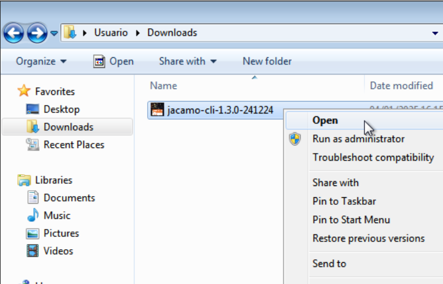
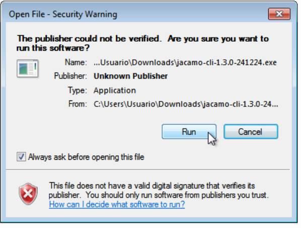
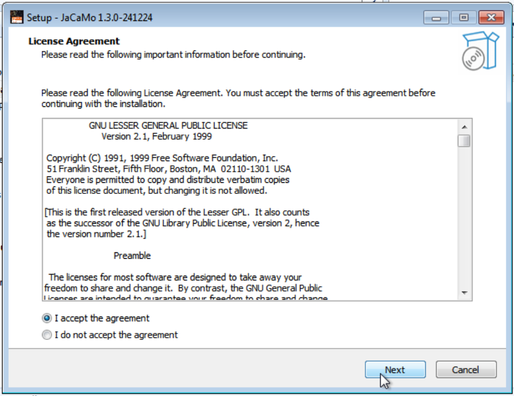
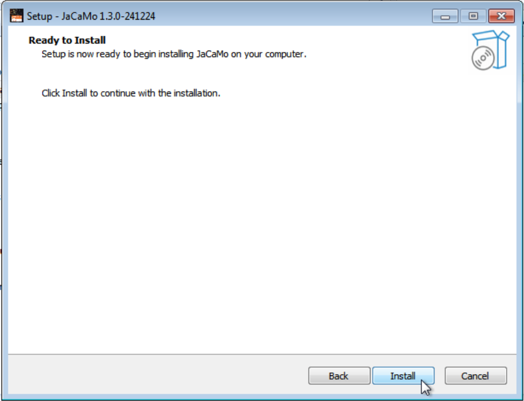
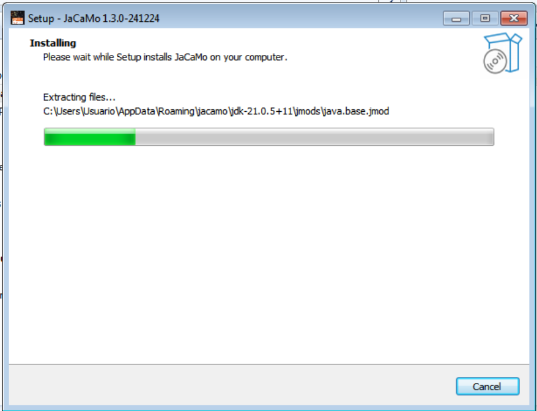
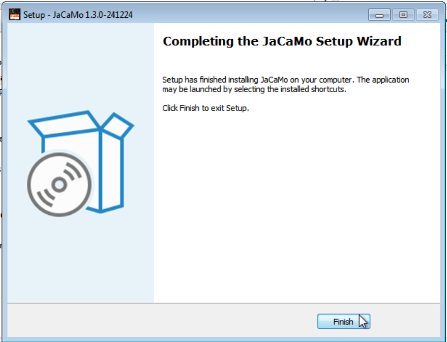
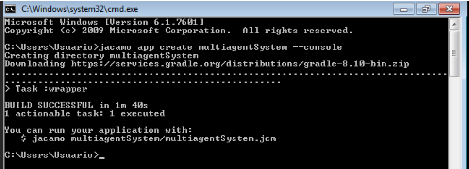
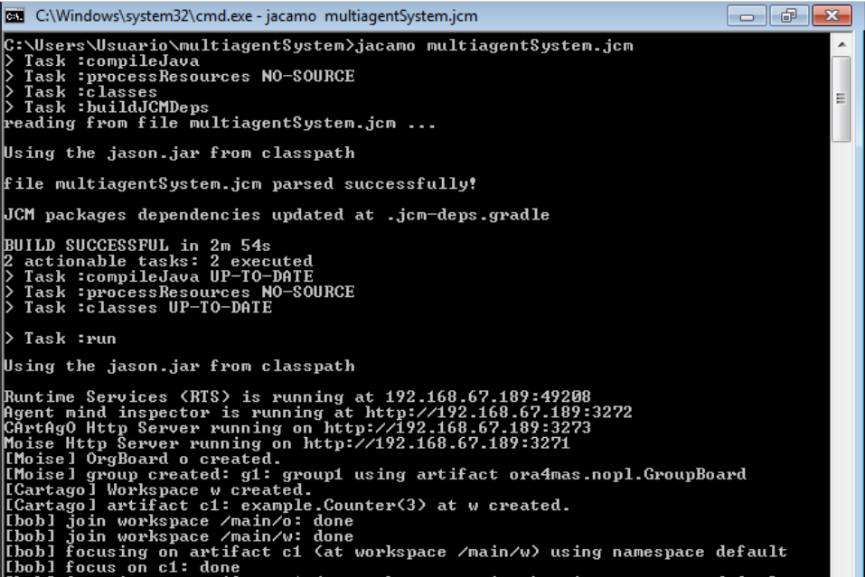

# Windows Installer for [JaCaMo CLI](https://github.com/jacamo-lang/jacamo-cli)

This repo provides the JaCaMo CLI, a command-line interface tool to create and manage JaCaMo projects for Microsoft Windows&trade;.

The JaCaMo project aims to promote the Multi-Agent Oriented Programming (MAOP) approach by providing a development platform that integrates tools and languages for programming the following dimensions of Multi-Agent Systems: agents (Jason), environment (Cartago), and organisation (Moise).

The JaCaMo platform is distributed under the licences of each platform, i.e. available open source and under GNU LGPL.

## INSTALATION
1. First you need get the [jacamo-installer](https://packages.chon.group/windows/jacamo-cli/) file provided by [Chon Group](https://chon.group)
2. Proceed with the instalation, like below:

    ||||
    |:-:|:-:|:-:|
    ||||
    ||||


## USING
To execute the JaCaMo execute the following commands in the ___cmd.exe___:
```
jacamo app create multiagentSystem --console
cd multiagentSystem
jacamo multiagentSystem.jcm 
```
|||
|:-:|:-:|
|||

## INFO
See the [JaCaMo web site](https://jacamo-lang.github.io/).


## COPYRIGHT
The [JaCaMo project](https://github.com/jacamo-lang/jacamo) aims to promote the Multi-Agent Oriented Programming (MAOP) approach by providing a development platform that integrates tools and languages for programming the following dimensions of Multi-Agent Systems: agents, environment, and organisation.